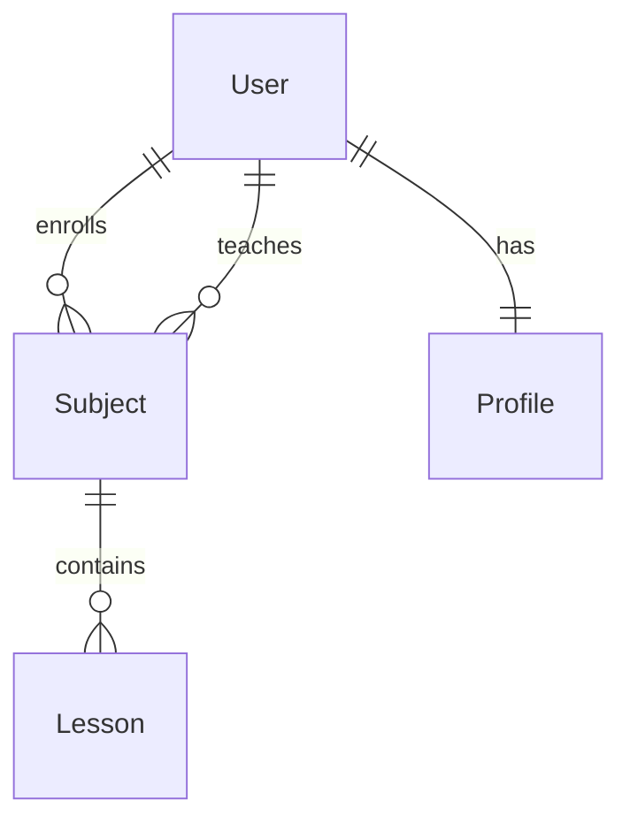

# Arquitectura del Sistema

## Aplicaciones utilizada en el proyecto:

:material-security: accounts: Gestión de autenticación.

:file_folder: shared: Artefactos compartidos.

:person_frowning: users: Gestión de usuarios.

:closed_book: subjects: Gestión de módulos y lecciones.

## Diagrama de Arquitectura



## Los modelos

Subject:

```py title="models.py"
class Subject(models.Model):
    code = models.CharField(unique=True, max_length=255)
    name = models.CharField(max_length=255)
    students = models.ManyToManyField(
        settings.AUTH_USER_MODEL, related_name='student_subjects', through=Enrollment, blank=True
    )
    teacher = models.ForeignKey(
        settings.AUTH_USER_MODEL,
        on_delete=models.PROTECT,
        related_name='teacher_subjects',
    )

```

Lesson:

```py title="models.py"
class Lesson(models.Model):
    subject = models.ForeignKey(
        'subjects.Subject', on_delete=models.CASCADE, related_name='lessons'
    )
    title = models.CharField(max_length=255)
    content = models.TextField(
        blank=True,
    )

    def __str__(self):
        return self.title

```

Enrollment:

```py title="models.py"
class Enrollment(models.Model):
    student = models.ForeignKey(
        settings.AUTH_USER_MODEL, on_delete=models.CASCADE, related_name='enrolled'
    )
    subject = models.ForeignKey(
        'subjects.Subject', on_delete=models.CASCADE, related_name='enrollments'
    )
    enrolled_at = models.DateField(auto_now_add=True)
    mark = models.PositiveSmallIntegerField(
        validators=[MinValueValidator(1), MaxValueValidator(10)], null=True, blank=True
    )

    def __str__(self):
        return f'{self.student.username} - {self.subject.name}'

    def __init__(self, *args, **kwargs):
        user = kwargs.pop('user', None)
        super().__init__(*args, **kwargs)
        if user:
            self.fields['options'].queryset = Subject.objects.exclude(enrollments__student=user)

```

Profile:

```py title="models.py"
class Profile(models.Model):
    class Role(models.TextChoices):
        STUDENT = 'S', 'Student'
        TEACHER = 'T', 'Teacher'

    role = models.CharField(max_length=1, choices=Role, default=Role.STUDENT)
    user = models.OneToOneField(
        settings.AUTH_USER_MODEL, on_delete=models.CASCADE, related_name='profile'
    )
    bio = models.TextField(blank=True)
    avatar = models.ImageField(
        upload_to='avatars',
        blank=True,
        null=True,
        default='avatars/noavatar.png',
    )

    def __str__(self):
        return self.user.username

```

<!-- ## Relaciones entre los modelos:

Un Subject tiene un profesor (FK a User) y múltiples estudiantes (M2M a User a través de Enrollment).

Un Profile está relacionado con un User (uno a uno). -->
