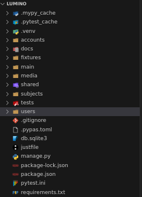

# Estructura del Código

## Organizacion del proyecto :material-file-tree:

## Tecnologías y Herramientas :tools:

- **[Django](https://www.djangoproject.com/)**: Framework web que permite la creación de aplicaciones rápidas y seguras.
- **[Django-RQ](https://github.com/rq/django-rq)**: Para gestionar tareas asíncronas como la generación de certificados.
- **[Pytest](https://pytest.org/)**: Framework para escribir pruebas automatizadas en Python.
- **[Bootstrap](https://getbootstrap.com/)**: Framework CSS para diseño responsive y moderno.
- **[Crispy Forms](https://django-crispy-forms.readthedocs.io/)**: Paquete que mejora el diseño de los formularios en Django.
- **[Django Reload](https://github.com/adamchainz/django-browser-reload)**: Recarga el proyecto automáticamente al detectar cambios en el código.
- **[Django Markdownify](https://pypi.org/project/django-markdownify/)**: Convierte texto en formato Markdown a HTML en Django.
- **[Sorl Thumbnail](https://sorl-thumbnail.readthedocs.io/)**: Genera y gestiona miniaturas de imágenes de forma eficiente en Django.

<!-- Django: Framework web que permite la creación de aplicaciones rápidas y seguras.

Django-RQ: Para gestionar tareas asíncronas como la generación de certificados.
Pytest:

Boostrap: Es un framework de css

Crispy Forms: Es un paquete de formulario

Django Reload: Recarga el proyecto desde que detecta cambios automaticamente

Django Markdownify:

Sorl Thumbnail: -->

## Instrucciones de Configuración :octicons-gear-16:

#### Clona el repositorio:

git clone https://github.com/David-Luis-Mora/Lumino

cd lumino

#### Crea un entorno virtual y activa:

python3 -m venv venv

#### Activar el entorno:

source venv/bin/activate

#### Instala las dependencias:

pip install -r requirements.txt

#### Levantar el proyecto:

./manage.py runserver
