## Requisitos Funcionales:

- Autenticación de usuarios: El sistema debe permitir que los usuarios se registren, inicien sesión y gestionen su sesión.
- Gestión de módulos y lecciones: Los profesores pueden crear y gestionar módulos y lecciones.
- Matrícula y desmatrícula: Los estudiantes pueden matricularse y desmatricularse de los módulos.
- Calificaciones: Los profesores pueden asignar y editar las calificaciones de los estudiantes en los módulos.
- Certificados: Los estudiantes pueden solicitar certificados de calificaciones.

## Requisitos No Funcionales

- Seguridad: El sistema debe asegurar la autenticación y autorización de los usuarios.
- Rendimiento: El sistema debe ser eficiente en la carga de datos de los módulos, lecciones y calificaciones.
- Escalabilidad: El sistema debe ser capaz de soportar más módulos y usuarios en el futuro.

## Restricciones

El acceso a ciertas funcionalidades (como la edición de calificaciones) está restringido según el rol (profesor o alumno).

## Casos de Uso:

```mermaid
graph LR
Profesor["👨‍🏫 Profesor"] --Crear--> Modulo["📚 Módulo"]
Profesor --Agregar--> Leccion["📖 Lección"]
Profesor --Asignar--> Calificacion["📝 Calificación"]
```

```mermaid
graph LR
  Estudiante["🎓 Estudiante"] --matricular--> Modulo["📚 Módulo"]
  Estudiante --Ver--> Leccion["📖 Lección"]
  Estudiante --Consultar--> Calificacion["📝 Calificación"]
```

